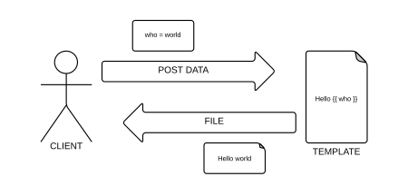
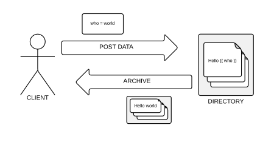

#################################
Diecutter: templates as a service
#################################

Presentation at an `AFPY <http://www.afpy.org>`_ event, march 2013, Paris.

By Rémy Hubscher and Benoit Bryon.

Slides available on https://diecutter.readthedocs.org

This presentation is published under `CC BY 3.0
<http://creativecommons.org/licenses/by/3.0/>`_

-------------------------------------------------------------------------------

Render templates
================

-------------------------------------------------------------------------------

Render directories
==================

-------------------------------------------------------------------------------

Generate configuration
======================

Setup template "diecutter.ini" server-side:

.. code-block:: jinja

   diecutter.template_dir = {{ template_dir|default('') }}
   diecutter.token = {{ token|default('') }}
   diecutter.readonly = {{ readonly|default('false') }}

Generate configuration client-side:

.. code-block:: sh

   wget --post-data="template_dir=src/templates"  \
        --output-document="diecutter.ini"     \
        http://diecutter.io/diecutter.ini

-------------------------------------------------------------------------------

Generate code
=============

``django startproject`` reloaded:

.. code-block:: sh

   curl --data "django_project=demo"                      \
        http://diecutter.io/+django_project+  \
        > demo.zip

-------------------------------------------------------------------------------

PasteScript is complicated
==========================

* needs PasteScript and templates installed locally
* template registration is a pain:

  * create template files (Cheetah markup)
  * create template class (Cheetah Template)
  * update template package's entry points (setup.py)
  * update your environment (reinstall/update)

* Cheetah?

-------------------------------------------------------------------------------

Provisioners are overkill
=========================

* I just want to render a template against data!
* I don't need Chef, Salt, Puppet & co.
* Templates aren't only useful in provisioning.

**And I'd like to reuse templates whatever the provisioning tool!**

-------------------------------------------------------------------------------

Diecutter's REST API
====================

* **POST** data and retrieve generated files
* **GET** raw content of templates
* **PUT** templates from client to server
* **DELETE** template :sup:`(1)`
* **OPTIONS** lists template variables :sup:`(1)`
* **PATCH** alters default values of variables :sup:`(1)`

:sup:`(1)` Work in progress.

-------------------------------------------------------------------------------

KISS
====

* focus on API
* no builtin client
* no builtin form validation
  (have a look at `daybed <https://pypi.python.org/pypi/daybed>`_)

-------------------------------------------------------------------------------

Encapsulated implementation(s)
==============================

* template resources backend
  
  * Today: local filesystem.
  * Tomorrow: remote Git/Hg/..., NoSQL, include/extend URLs

* template engines

  * Today: Jinja.
  * Tomorrow: Cheetah, ERB, XSLT...

* response writers
  
  * Today: return single file or ZIP archive.
  * Tomorrow: tar.gz, write to storage, attachments, streaming, asynchronous
    generation...

-------------------------------------------------------------------------------

Roadmap
=======

* **today: proof of concept, focus on API**
* tomorrow: rock-solid defaults, focus on stability & performance
* later: make your own, focus on extensibility

-------------------------------------------------------------------------------

Resources
=========

* PyPI: https://pypi.python.org/pypi/diecutter
* Code repository: https://github.com/diecutter/diecutter/
* Bugs and features: https://github.com/diecutter/diecutter/issues
* Slides: `http://tech.novapost.fr
  <http://tech.novapost.fr/images/slides/afpy-20130304-diecutter.html>`_
