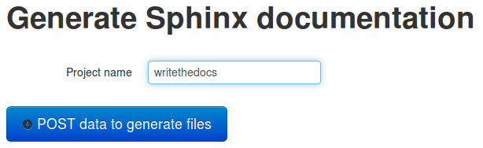
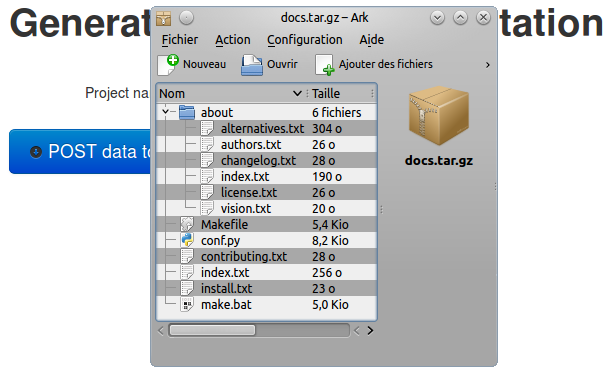

diecutter.io
============

Lightning-talk at `Write The Docs Europe 2014
<http://conf.writethedocs.org/eu/2014//>`_, Budapest.

By Benoît Bryon <benoit@marmelune.net> @benoitbryon

Slides available on https://diecutter.readthedocs.org

-------------------------------------------------------------------------------

I am a developer
================

* testing documentation
* automating tedious tasks

-------------------------------------------------------------------------------

Start a new Sphinx documentation
================================

-------------------------------------------------------------------------------

sphinx-quickstart
=================

.. code:: text

   docs/
   ├── conf.py
   ├── index.txt
   └── Makefile

-------------------------------------------------------------------------------

Add content
===========

.. code:: text

   docs/
   ├── about/
   │   ├── alternatives.txt
   │   ├── authors.txt
   │   ├── changelog.txt
   │   ├── index.txt
   │   ├── license.txt
   │   └── vision.txt
   ├── conf.py
   ├── contributing.txt
   ├── index.txt
   ├── install.txt
   └── Makefile

-------------------------------------------------------------------------------

Do it again
===========

-------------------------------------------------------------------------------

Foreach project: do it again
============================

-------------------------------------------------------------------------------

Setup a template
================

.. code:: jinja

   Welcome to {{ project_name }}'s documentation!

-------------------------------------------------------------------------------

Submit data
===========

-------------------------------------------------------------------------------

Download generated files
========================

-------------------------------------------------------------------------------

Template rendering as a service
===============================

.. image:: overview-file.svg

-------------------------------------------------------------------------------

For everything you copy-paste-adapt
===================================

-------------------------------------------------------------------------------

In documentations
=================

Before:

    Copy-paste-adapt the following example with your values...

After:

    Fill in the form...

-------------------------------------------------------------------------------

diecutter's philosophy
======================

* Create and publish templates as you like
* Design a nice UI with html/css/js
* Users focus on content

`diecutter` renders templates against data user submits via UI.

-------------------------------------------------------------------------------

diecutter works
===============

* `Jinja2` template engine
* reads templates on `Github`
* writes single files, tar.gz, zip
* do it yourself UI

-------------------------------------------------------------------------------

diecutter is improving
======================

* index of templates
* `Django`, `ERB`, ..., template engines
* read templates for additional locations, including local files
* libraries to create UI
* **improved documentation** ;)

-------------------------------------------------------------------------------

Let's try diecutter!
====================

* SAAS: http://diecutter.io
* Documentation: https://diecutter.readthedocs.org
* Slides: `https://diecutter.readthedocs.org
  <https://diecutter.readthedocs.org/en/latest/_static/20140331-writethedocs-budapest.html>`__
